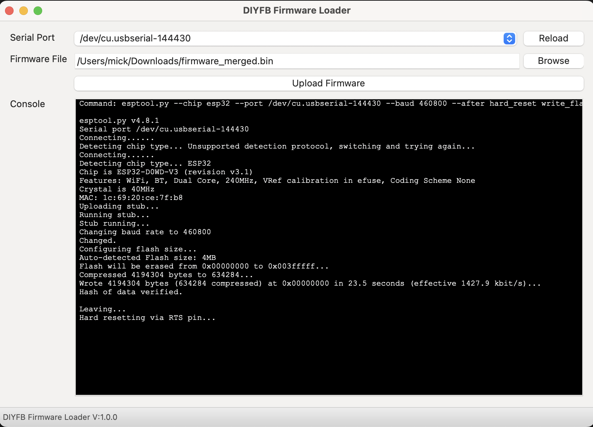

# DIYFB Firmware Flasher


 &nbsp;&nbsp;  &nbsp;&nbsp;  &nbsp;&nbsp;  &nbsp;&nbsp;  &nbsp;&nbsp;  &nbsp;&nbsp;  

DIYFB Firmware Flasher is a companion tool for the [DIY Flow Bench project](https://github.com/DeeEmm/DIY-Flow-Bench/).




## Installation
 The app doesn't have to be installed, just double-click it and it'll start. Check the [releases section](https://github.com/DeeEmm/DIYFB-Firmware-Flasher/releases) for downloads for your platform. For every release there's at least a .exe file for Windows and a .dmg for macOS.

## Status
Scan the [list of open issues](https://github.com/DeeEmm/DIYFB-Firmware-Flasher/issues) for bugs and pending features.


## Getting help
In the unlikely event that you're stuck with this simple tool the best way to get help is to create a discsussion over on the main [DIYFB Forums](https://github.com/DeeEmm/DIY-Flow-Bench/discussions) 


## Build it yourself
If you want to build this application yourself you need to:

- Install [Python 3.x](https://www.python.org/downloads/) and [Pip](https://pip.pypa.io/en/stable/installing/) (it comes with Python if installed from `python.org`).
- Create a virtual environment with `python -m venv venv`
- Activate the virtual environment with `. venv/bin/activate` (`. venv/Scripts/activate` if you are on Windows with [Cygwin](https://www.cygwin.com/) or [Mingw](http://mingw.org/))
- Run `pip install -r requirements.txt`

**A note on Linux:** As described on the [downloads section of `wxPython`](https://www.wxpython.org/pages/downloads/), wheels for Linux are complicated and may require you to run something like this to install `wxPython` correctly:

```bash
# Assuming you are running it on Ubuntu 18.04 LTS with GTK3
pip install -U \
    -f https://extras.wxpython.org/wxPython4/extras/linux/gtk3/ubuntu-18.04 \
    wxPython
```

## Credits / About

DIYFB Firmware Flasher is a self-contained [NodeMCU](https://github.com/nodemcu/nodemcu-firmware) flasher with GUI based on [esptool.py](https://github.com/espressif/esptool) and [wxPython](https://www.wxpython.org/). Based on cut down version of Marcel Stoers [nodemcu-pyflasher](https://github.com/marcelstoer/nodemcu-pyflasher)

It is essentially a cut down version of Marcels work, with a few minor modifications to make a simple firmwre uploader for DIYFB users to use. 

## License
[MIT](http://opensource.org/licenses/MIT) © Marcel Stör
